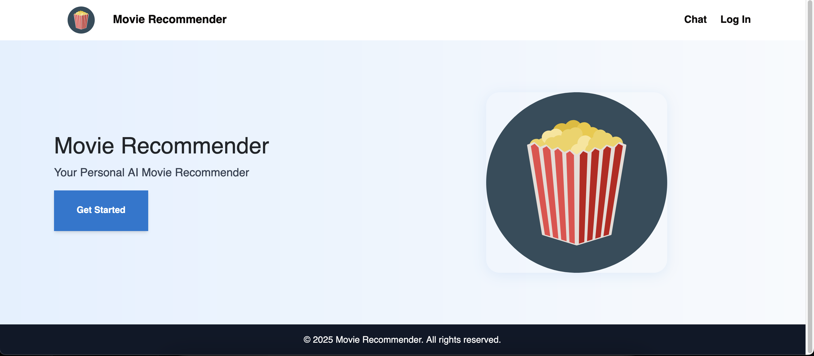

# Project Description

A simple chatbot that uses retrieval augmented generation (RAG) to recommend movies to a user. This project uses flask, react typescript, Postgres, pgvector and docker.

It is a simple chat interface where a user can ask to get movies recommended. The agent will then use a tool to search in a vector database similar movies to those of the interest of the user. It will then return those movies to the user.
I used the OpenAI embeddings model to generate the embeddings for movies descriptions. The descriptions were from letterboxd. I saved the embeddings to a pkl file to then seed into the database instead of calling the model on start up if I had to take down the container. You can see how I did that in `./backend/app/chat/utils/debugging` and `./backend/seed.py`

Additionally the chatbot is equipped with tools to search news or search google for current movies and tell the user about them.

# How to Run

First set up the Environment. In the backend you need to set up a .env file with the following

```
DATABASE_URL=
OPENAI_API_KEY=
COMPOSIO_API_KEY=
```

You can get the database url from the docker compose file.
Then to run just do.

```sh
docker compose up --build
```

Then you can go to local host and you should be able to chat!

# Demo

Home Page


Searching popular movies


Recommending Movies


